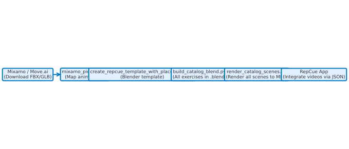

# RepCue Exercise Video Generation Workflow

## Problem Statement
RepCue tracks exercises and workouts beautifully, but currently lacks video support to visually guide users per repetition. You need **short, loopable exercise demos** (1–3s per repetition or holds) for your app, with:
- Consistent framing, pose, and lighting  
- Seamless looping per rep or hold  
- Commercial licensing clarity  

**Alternatives**:
1. **Text-to-video generators (Runway, Luma, Pika, etc.)** – flashy promos but inconsistent framing, costly for repetition loops.  
2. **Motion‑capture → 3D avatar (Mixamo + Blender)** – stable, uniform, free, and fully customizable → **Preferred solution**.  
3. **AI phone mocap (Move.ai)** – for missing exercise data; adds cost & cleanup, but usable selectively.

---

## Implementation Plan (Preferred Solution)

Mocap is short for motion capture. It’s the process of recording the movement of a person or object and turning it into digital animation data that you can apply to a 3D character.
A mocap file (like .fbx or .glb) contains keyframes of a person doing the exercise.

Some platforms like [Mixamo](https://www.mixamo.com/) (free, commercial use allowed), [ActorCore](https://actorcore.reallusion.com/3d-motion) (paid, commercial use allowed), and [Mocap Online](https://mocaponline.com/) (paid, commercial use allowed), offer precaptured animations downladable as mocap files (.fbx or .glb). 

For exercises where the mocap is not readily available on any of these platforms, you can generate your own mocap FBX/GLB using a single phone camera with tools like:
- [Move One – Move.ai](https://www.move.ai/): Stand in front of your phone, record, auto-convert to FBX.
- [DeepMotion Animate 3D](https://www.deepmotion.com/animate-3d): Upload video, get mocap FBX
- [Plask](https://plask.ai/en-US): 

### 1. Licensing: Mixamo Animations
[Mixamo](https://www.mixamo.com/) animations and characters are **royalty-free for personal, commercial, and non-profit use**, as long as the assets are embedded and not redistributed directly.  
Links:
- [Mixamo FAQ – Adobe](https://helpx.adobe.com/creative-cloud/faq/mixamo-faq.html)
- [Mixamo Licensing Forum](https://community.adobe.com/t5/mixamo-discussions/mixamo-faq-licensing-royalties-ownership-eula-and-tos/td-p/13234775)
- [Mixamo Tips – Kybernetik](https://kybernetik.com.au/animancer/docs/manual/getting/mixamo/)

### 2. Capture Gaps with Move One (optional)
For moves Mixamo lacks (e.g. bicycle crunches), use **[Move One – Move.ai](https://www.move.ai/)** – single-camera mocap. Free tier gives 30 credits; paid plans include:
- Starter: $18/mo (60 credits)  
- Standard: $48/mo (180 credits)  
- Plus: $225/mo (240 credits)  
- Advanced: $490/mo (700 credits)  
Outputs are commercial-usable per their [Terms of Service](https://docs.move.ai/knowledge/move-one-pricing).


---

## Included Files & How to Use

### 1. [[mixamo_picklist.csv](tools/blender/mixamo_picklist.csv)]([mixamo_picklist.csv](tools/blender/mixamo_picklist.csv))
**Purpose:** Maps each exercise to Mixamo search terms and notes.  
**Usage:**  
- Open in Excel or VS Code.  
- Use "search terms" to find the closest Mixamo animation.  
- Download FBX (Without Skin, 30 FPS).  
- Save as `/<assets>/fbx_glb/<exercise_id>.fbx`.

---

### 2. [[create_repcue_template_with_placeholder.py](tools/blender/create_repcue_template_with_placeholder.py)]([create_repcue_template_with_placeholder.py](tools/blender/create_repcue_template_with_placeholder.py))
**Purpose:** Builds a Blender scene template including lighting, camera, ground, and a placeholder armature with a looping pose.  
**Instructions:**  
1. Open Blender → Scripting tab → New → paste script → Run.  
2. Save as `repcue_template.blend`.

---

### 3. [[repcue_render_addon.py](tools/blender/repcue_render_addon.py)]([repcue_render_addon.py](tools/blender/repcue_render_addon.py))
**Purpose:** Adds a UI panel in Blender's Output Properties for one-click rendering of all three aspect ratios.  
**Instructions:**  
1. Blender → Preferences → Add-ons → Install → select file → Enable.  
2. In your `.blend`, open **Properties → Output** tab → “RepCue” panel appears.  
3. Set:
   - Output Dir (e.g. `//videos/`)
   - Exercise ID
   - Loop Duration / Static Hold toggle
   - Floor move checkbox  
4. Click **Render 3 Aspect Ratios** → renders into:
   ```
   <output_dir>/<exercise_id>_v1_1080x1080.mp4
   ..._1080x1920.mp4
   ..._1920x1080.mp4
   ```

---

### 4. [[blender_batch_render.py](tools/blender/blender_batch_render.py)]([blender_batch_render.py](tools/blender/blender_batch_render.py))
**Purpose:** Automates rendering across multiple exercises from CLI.  
**Usage Example:**
```bash
blender -b -P [blender_batch_render.py](tools/blender/blender_batch_render.py) -- \
  --src "/assets/fbx_glb" \
  --out "/assets/videos" \
  --ids squats push-ups lunges ... \
  --fps 30 --seconds 2.2 --static_seconds 10
```

---

### 5. [[[build_catalog_blend.py](tools/blender/build_catalog_blend.py)](tools/blender/[build_catalog_blend.py](tools/blender/build_catalog_blend.py))]([[build_catalog_blend.py](tools/blender/build_catalog_blend.py)](tools/blender/[build_catalog_blend.py](tools/blender/build_catalog_blend.py)))  **(NEW)**
**Purpose:** Creates a single `.blend` file with **one scene per exercise** by cloning your template scene and importing the matching FBX/GLB.  
**Instructions:**
```bash
blender -b -P [[build_catalog_blend.py](tools/blender/build_catalog_blend.py)](tools/blender/[build_catalog_blend.py](tools/blender/build_catalog_blend.py)) -- \
  --template "/path/to/repcue_template.blend" \
  --src "/assets/fbx_glb" \
  --out_blend "/assets/repcue_exercises_catalog.blend" \
  --ids squats push-ups lunges plank ... \
  --static_ids plank side-plank wall-sit downward-dog child-pose single-leg-stand tree-pose warrior-3 forward-fold finger-roll \
  --seconds 2.2 --static_seconds 10 --fps 30
```
- After creation, open `/assets/repcue_exercises_catalog.blend` in Blender to preview each scene.

---

### 6. [[[render_catalog_scenes.py](tools/blender/render_catalog_scenes.py)](tools/blender/[render_catalog_scenes.py](tools/blender/render_catalog_scenes.py))]([[render_catalog_scenes.py](tools/blender/render_catalog_scenes.py)](tools/blender/[render_catalog_scenes.py](tools/blender/render_catalog_scenes.py)))  **(NEW)**
**Purpose:** Renders **all scenes** in a `.blend` (one per exercise) into 3 aspect ratios.  
**Usage:**
```bash
blender -b "/assets/repcue_exercises_catalog.blend" -P [[render_catalog_scenes.py](tools/blender/render_catalog_scenes.py)](tools/blender/[render_catalog_scenes.py](tools/blender/render_catalog_scenes.py)) -- \
  --out "/assets/videos" \
  --fps 30 \
  --seconds 2.2 \
  --static_seconds 10 \
  --static_ids plank side-plank wall-sit downward-dog child-pose single-leg-stand tree-pose warrior-3 forward-fold finger-roll
```
Optional:
- `--subset squats push-ups` to render only certain scenes.

---

## Suggested Folder Structure
```
assets/
  fbx_glb/              # Raw FBX/GLB files from Mixamo or mocap
  videos/               # Output videos for RepCue
  blender/              # .blend files (template, catalog)
tools/
  blender/
    [mixamo_picklist.csv](tools/blender/mixamo_picklist.csv)
    [create_repcue_template_with_placeholder.py](tools/blender/create_repcue_template_with_placeholder.py)
    [repcue_render_addon.py](tools/blender/repcue_render_addon.py)
    [blender_batch_render.py](tools/blender/blender_batch_render.py)
    [[build_catalog_blend.py](tools/blender/build_catalog_blend.py)](tools/blender/[build_catalog_blend.py](tools/blender/build_catalog_blend.py))
    [[render_catalog_scenes.py](tools/blender/render_catalog_scenes.py)](tools/blender/[render_catalog_scenes.py](tools/blender/render_catalog_scenes.py))
    repcue_pipeline_diagram.svg
```


```
assets/
  fbx_glb/              # Raw FBX/GLB files from Mixamo or mocap
  videos/               # Output videos for RepCue
  blender/              # .blend files (template, catalog)
tools/blender/          # All helper scripts
  [mixamo_picklist.csv](tools/blender/mixamo_picklist.csv)
  [create_repcue_template_with_placeholder.py](tools/blender/create_repcue_template_with_placeholder.py)
  [repcue_render_addon.py](tools/blender/repcue_render_addon.py)
  [blender_batch_render.py](tools/blender/blender_batch_render.py)
  [[build_catalog_blend.py](tools/blender/build_catalog_blend.py)](tools/blender/[build_catalog_blend.py](tools/blender/build_catalog_blend.py))
  [[render_catalog_scenes.py](tools/blender/render_catalog_scenes.py)](tools/blender/[render_catalog_scenes.py](tools/blender/render_catalog_scenes.py))
```

---

## Workflow Overview




| Step | File / Tool | Action |
|------|-------------|--------|
| 1 | [[mixamo_picklist.csv](tools/blender/mixamo_picklist.csv)](tools/blender/[mixamo_picklist.csv](tools/blender/mixamo_picklist.csv)) | Find Mixamo animation, download FBX |
| 2 | [[create_repcue_template_with_placeholder.py](tools/blender/create_repcue_template_with_placeholder.py)](tools/blender/[create_repcue_template_with_placeholder.py](tools/blender/create_repcue_template_with_placeholder.py)) | Generate Blender template |
| 3 | `[[build_catalog_blend.py](tools/blender/build_catalog_blend.py)](tools/blender/[build_catalog_blend.py](tools/blender/build_catalog_blend.py))` | Create one .blend with all exercises |
| 4 | `[[render_catalog_scenes.py](tools/blender/render_catalog_scenes.py)](tools/blender/[render_catalog_scenes.py](tools/blender/render_catalog_scenes.py))` | Render every scene to 3 aspect ratios |
| 5 | [[repcue_render_addon.py](tools/blender/repcue_render_addon.py)](tools/blender/[repcue_render_addon.py](tools/blender/repcue_render_addon.py)) | Optional – one-click UI render per scene |
| 6 | [[blender_batch_render.py](tools/blender/blender_batch_render.py)](tools/blender/[blender_batch_render.py](tools/blender/blender_batch_render.py)) | Optional – batch render from FBX without catalog |
| 7 | App integration | Load videos using JSON mapping |

---

## Additional Resources
- [Mixamo FAQ – Adobe](https://helpx.adobe.com/creative-cloud/faq/mixamo-faq.html)  
- [Mixamo Licensing Forum](https://community.adobe.com/t5/mixamo-discussions/mixamo-faq-licensing-royalties-ownership-eula-and-tos/td-p/13234775)  
- [Move One Pricing – Move.ai](https://docs.move.ai/knowledge/move-one-pricing)  
- [Move.ai Website](https://www.move.ai/)  

---


## Move.ai Mocap Integration

When an exercise animation is **not available** in Mixamo, you can use **Move.ai** to record it yourself and export as FBX. This guide shows how to integrate a Move.ai mocap file into the RepCue animation/video pipeline.

---

### **A) Fast Path – Use Move.ai Actor Directly**
If you don’t need the exact same avatar for every exercise, you can use the exported mocap character as-is.

1. **Record & Export from Move.ai**
   - Record the exercise.
   - Export as **FBX** at **30 FPS**.
   - Name the file according to your exercise ID, e.g., `bicycle-crunches.fbx`.

2. **Place in Assets Folder**
   - Save the file to:
     ```
     assets/fbx_glb/bicycle-crunches.fbx
     ```

3. **Render**
   - Build a multi-scene catalog:
     ```bash
     blender -b -P [[build_catalog_blend.py](tools/blender/build_catalog_blend.py)](tools/blender/[build_catalog_blend.py](tools/blender/build_catalog_blend.py)) --        --template "/path/to/repcue_template.blend"        --src "/assets/fbx_glb"        --out_blend "/assets/repcue_exercises_catalog.blend"        --ids bicycle-crunches plank push-ups
     ```
   - Render all scenes:
     ```bash
     blender -b "/assets/repcue_exercises_catalog.blend" -P [[render_catalog_scenes.py](tools/blender/render_catalog_scenes.py)](tools/blender/[render_catalog_scenes.py](tools/blender/render_catalog_scenes.py)) --        --out "/assets/videos" --fps 30 --seconds 2.2
     ```

✅ **Pros**: Quickest workflow.  
⚠️ **Cons**: Visual style may differ from other animations.

---

### **B) Retarget to Mixamo Avatar for Consistency**
If you want the same avatar, camera, and style for all exercises, retarget the mocap data to your Mixamo rig.

#### 1. Prepare the Template
- Open `repcue_template.blend`.
- Import your **Mixamo character FBX** (e.g., Y-Bot).
- Save this as your base template.

#### 2. Import Move.ai FBX
- `File → Import → FBX` → select `bicycle-crunches.fbx`.
- You will now have:
  - `Armature_Mixamo` (Mixamo rig)
  - `Armature_Mocap` (Move.ai rig)

#### 3. Retarget via Constraints
- Select `Armature_Mixamo`, switch to **Pose Mode**.
- For each major bone, add **Copy Rotation** (and optionally Copy Location) constraints targeting the mocap rig.
- Common bone mapping:
  - Hips/root → Hips/root
  - Spine/Chest → Spine/Chest
  - Head → Head
  - Arms/Legs → corresponding mocap bones
- Adjust influence or offsets to fine-tune.

#### 4. Loop and Align
- Match FPS (30).
- Trim animation to exactly one repetition loop.
- Align first and last frame for smooth looping.

#### 5. Hide Mocap Actor
- In Outliner, disable mocap armature/mesh from render.

#### 6. Save and Render
- Save scene and run:
  ```bash
  blender -b -P [[render_catalog_scenes.py](tools/blender/render_catalog_scenes.py)](tools/blender/[render_catalog_scenes.py](tools/blender/render_catalog_scenes.py)) --     --out "/assets/videos" --fps 30 --seconds 2.2
  ```

✅ **Pros**: Perfect visual consistency.  
⚠️ **Cons**: Takes ~10–20 min for initial bone mapping.

---

### Tips & Troubleshooting

**Foot Sliding**  
- Keep Mixamo root controlling location.  
- Add IK to feet if needed.

**Scale Mismatch**  
- Apply uniform scale to 1.0 for both rigs (`Ctrl+A → Apply Scale`).

**FPS Mismatch**  
- Export from Move.ai at **30 FPS** or resample in Blender.

**A‑Pose/T‑Pose Offset**  
- Add a one-frame pose key to align Mixamo rig to mocap's start pose.

**Noise/Jitters**  
- Use Blender's **Smooth Keys** on noisy bones.

---

**Recommendation**  
- For **rare or one-off moves**, use Path A.  
- For **catalog consistency**, use Path B.

---

**References**  
- [Move.ai](https://www.move.ai/)  
- [Blender – Constraints Manual](https://docs.blender.org/manual/en/latest/animation/constraints/introduction.html)  
- [Mixamo](https://www.mixamo.com/)
