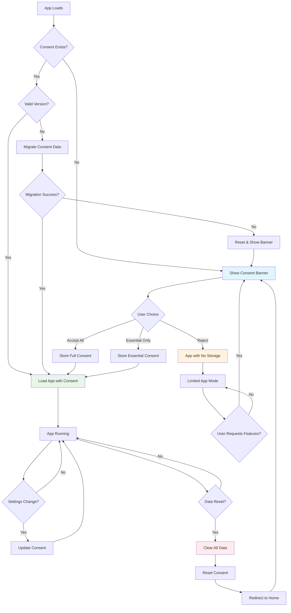

# RepCue Consent Management System

## Overview

RepCue implements a robust, privacy-first consent management system that respects user privacy while providing a seamless fitness tracking experience. The system is designed to be GDPR-compliant, transparent, and user-centric.

## Purpose and Objectives

### Core Purpose
The consent system serves multiple critical functions:

- **Legal Compliance**: Ensures adherence to GDPR, CCPA, and other data protection regulations
- **User Privacy**: Gives users complete control over their data and how it's used
- **Transparency**: Clearly communicates what data is collected and why
- **Trust Building**: Establishes trust through clear, honest data practices
- **Graceful Degradation**: App remains functional even without data storage consent

### Key Principles

1. **Privacy by Design**: Data protection is built into every aspect of the system
2. **User Control**: Users have granular control over different types of consent
3. **Transparency**: Clear, jargon-free explanations of data usage
4. **Reversibility**: Users can revoke consent at any time
5. **Future-Proof**: Versioned system allows for regulatory changes

## Consent Types and Granularity

### Essential Consent
- **Purpose**: Basic app functionality
- **Data**: Exercise preferences, timer settings
- **Storage**: Local device only
- **Required**: Yes (app won't function without this)

### Analytics Consent
- **Purpose**: App improvement and performance monitoring
- **Data**: Usage patterns, performance metrics (anonymized)
- **Storage**: Local aggregation only
- **Required**: No (optional)

### Marketing Consent
- **Purpose**: Feature updates and fitness tips
- **Data**: User preferences for communications
- **Storage**: Local preferences only
- **Required**: No (optional)

## Consent Versioning System

### Version History

#### Version 1 (Legacy)
```typescript
interface ConsentV1 {
  hasConsented: boolean;
  timestamp: string;
}
```

#### Version 2 (Previous)
```typescript
interface ConsentV2 {
  version: 2;
  timestamp: string;
  hasConsented: boolean;
  cookiesAccepted: boolean;
  analyticsAccepted: boolean;
  marketingAccepted: boolean;
  dataRetentionDays: number;
}
```

#### Version 3 (Current) — Legal Acceptance System
```typescript
interface ConsentV3 {
  version: 3;
  timestamp: string;
  hasConsented: boolean;
  cookiesAccepted: boolean;
  analyticsAccepted: boolean;
  marketingAccepted: boolean;
  dataRetentionDays?: number;
  legalAcceptances: LegalAcceptance[];
}

interface LegalAcceptance {
  docId: string;              // Document identifier (e.g., 'terms_conditions')
  acceptedVersion: string;    // Version user accepted (e.g., '1.0.0')
  contentHash: string;        // Hash of accepted content
  acceptedLocale: string;     // Locale user accepted (e.g., 'en', 'ar')
  acceptedAt: string;         // ISO timestamp of acceptance
}
```

**Key Changes in V3**:
- Added `legalAcceptances` array for tracking document-level acceptance
- Version-based tracking for Terms, Privacy Policy, Cookie Policy, etc.
- Content hash validation to detect document changes
- Locale-specific acceptance tracking
- Maintains all V2 consent features (cookies, analytics, marketing)

### Migration Strategy
- **Automatic Migration**: Old consent data is automatically upgraded
  - V1→V2: Adds granular consent fields
  - V2→V3: Adds empty `legalAcceptances` array, preserves all V2 fields
- **Backward Compatibility**: Legacy data is preserved during migration
- **Failure Handling**: Malformed data triggers fresh consent request
- **User Notification**: Users are informed when migration occurs
- **Migration Testing**: Comprehensive test suite validates all migration paths

## Regulatory Compliance

### GDPR Compliance
- ✅ **Lawful Basis**: Clear consent for data processing
- ✅ **Data Minimization**: Only necessary data is collected
- ✅ **Purpose Limitation**: Data used only for stated purposes
- ✅ **Storage Limitation**: Configurable retention periods
- ✅ **Right to Withdraw**: Easy consent revocation
- ✅ **Right to Erasure**: Complete data deletion capability
- ✅ **Transparency**: Clear privacy information

### CCPA Compliance
- ✅ **Consumer Rights**: Right to know, delete, and opt-out
- ✅ **Data Disclosure**: Clear information about data collection
- ✅ **Opt-Out Rights**: Easy mechanisms to refuse data sale (N/A - no data sales)

### Other Regulations
- **Privacy Act**: Compliant with Australian Privacy Principles
- **PIPEDA**: Aligned with Canadian privacy requirements
- **Lei Geral de Proteção de Dados (LGPD)**: Brazilian data protection compliance

## User Control and Experience

### Consent Banner Features
- **Non-Intrusive**: Doesn't block app functionality unnecessarily
- **Clear Choices**: "Accept All" and "Essential Only" options
- **Detailed Information**: Expandable privacy details
- **Accessibility**: WCAG 2.1 compliant, keyboard navigable
- **Mobile Optimized**: Responsive design for all devices

### Settings Integration
- **Real-Time Control**: Change consent preferences anytime
- **Visual Indicators**: Clear status of current consent settings
- **Data Export**: Download personal data in JSON format
- **Complete Reset**: Nuclear option to clear all data and consent

## Design and Architecture

### Service-Oriented Design
The consent system is implemented as a singleton service (`ConsentService`) that:

- Manages all consent-related operations
- Provides a clean API for the rest of the application
- Handles persistence and migration automatically
- Emits events for consent changes

### Key Components

#### 1. ConsentService
```typescript
class ConsentService {
  // Core consent management
  hasConsent(): boolean
  setConsent(data: ConsentData): void
  revokeConsent(): void
  
  // Granular consent checking
  hasAnalyticsConsent(): boolean
  hasMarketingConsent(): boolean
  
  // Migration and versioning
  getConsentStatus(): ConsentStatus
  migrateConsentData(): void
  
  // Data management
  resetConsent(): void
  reloadConsentData(): void
}
```

#### 2. ConsentBanner Component
- React component for consent collection
- Responsive design with accessibility features
- Integrated with ConsentService for state management

#### 3. Storage Integration
- All storage operations check consent before proceeding
- Graceful degradation when consent is not given
- Automatic cleanup when consent is revoked

### Data Flow

```
User Interaction → ConsentBanner → ConsentService → localStorage
                                       ↓
Application Components ← Consent Status ← Event Emission
```

## Consent Lifecycle Diagram



## Implementation Details

### Consent Storage
```typescript
const CONSENT_STORAGE_KEY = 'repcue_consent';

// Storage format in localStorage (V3)
{
  "version": 3,
  "timestamp": "2025-10-22T10:30:00.000Z",
  "hasConsented": true,
  "cookiesAccepted": true,
  "analyticsAccepted": false,
  "marketingAccepted": false,
  "dataRetentionDays": 365,
  "legalAcceptances": [
    {
      "docId": "terms_conditions",
      "acceptedVersion": "1.0.0",
      "contentHash": "sha256_hash_of_content",
      "acceptedLocale": "en",
      "acceptedAt": "2025-10-22T10:30:00.000Z"
    },
    {
      "docId": "privacy_policy",
      "acceptedVersion": "1.0.0",
      "contentHash": "sha256_hash_of_content",
      "acceptedLocale": "en",
      "acceptedAt": "2025-10-22T10:30:00.000Z"
    }
  ]
}
```

### Migration Logic
1. **Load existing data** from localStorage
2. **Check version** against current version
3. **Apply migrations** sequentially if needed
4. **Validate result** for data integrity
5. **Fallback to reset** if migration fails

### Error Handling
- **Malformed Data**: Triggers fresh consent request
- **Storage Errors**: Graceful degradation to memory-only mode
- **Migration Failures**: Automatic reset with user notification
- **Network Issues**: Local-first approach unaffected

## Legal Acceptance System (V3)

### Overview
RepCue V3 introduces a comprehensive legal document acceptance system that manages Terms & Conditions, Privacy Policy, Cookie Policy, and other legal documents separately from user consent preferences.

### Purpose
- **Regulatory Compliance**: Separate legal acceptance from optional data consent
- **Version Tracking**: Track which version of each document users accepted
- **Update Management**: Notify users of document updates with flexible enforcement
- **Locale Support**: Track acceptance per locale with intelligent fallback
- **Audit Trail**: Complete history of legal acceptances for compliance

### Legal Document Types

#### Required Documents
Documents that users must accept to use the app:
- **Terms & Conditions**: Legal agreement for app usage
- **Privacy Policy**: How user data is handled
- **Cookie Policy**: Cookie usage and preferences
- **Data Processing Agreement**: (if applicable)

#### Optional Documents
Informational documents that don't require acceptance:
- **Imprint**: Legal business information (display only)
- **Community Guidelines**: (for social features)

### Document Manifest System

#### Baseline Manifest
Static manifest file at `/legal/manifest.json` loaded on app boot:
```json
{
  "updatedAt": "2025-10-22T00:00:00.000Z",
  "documents": [
    {
      "id": "terms_conditions",
      "title": "Terms & Conditions",
      "version": "1.0.0",
      "required": true,
      "policy": "force",
      "effectiveFrom": "2025-10-15T00:00:00.000Z",
      "locales": [
        {
          "locale": "en",
          "path": "/legal/01-terms_en.md",
          "contentHash": "sha256_hash"
        },
        {
          "locale": "ar",
          "path": "/legal/01-terms_ar.md",
          "contentHash": "sha256_hash"
        }
      ]
    }
  ]
}
```

#### Live Manifest (Future)
Edge Function at `${SUPABASE_URL}/functions/v1/legal-manifest`:
- Fetched after baseline loads
- Provides real-time document updates
- Uses ETag caching to minimize bandwidth
- Falls back to baseline if unavailable

### Blocking Policies

#### Force Policy
Documents with `policy: "force"` block app access immediately when:
- User hasn't accepted the document
- Document version changes and user hasn't accepted new version
- `effectiveFrom` date is past (or not set)

**Use Case**: Critical legal changes that require immediate acceptance

#### Defer Policy
Documents with `policy: "defer"` allow continued app usage:
- Shows notification banner about pending acceptance
- User can continue using app during active workout
- Becomes blocking only after workout completes or timeout

**Use Case**: Non-critical updates that shouldn't interrupt user experience

### Effective Date System

#### Future Effective Date
```json
{
  "effectiveFrom": "2025-11-01T00:00:00.000Z",
  "policy": "force"
}
```
- Shows notification: "New terms effective November 1, 2025"
- User can continue using app until effective date
- Becomes blocking on/after effective date

#### Past Effective Date
```json
{
  "effectiveFrom": "2025-10-15T00:00:00.000Z",
  "policy": "force"
}
```
- Immediately blocks app access (if force policy)
- Requires acceptance before proceeding

#### No Effective Date
```json
{
  "policy": "defer"
}
```
- Takes effect immediately but with defer policy
- Shows notification, allows continued usage

### Locale Fallback System

#### Fallback Chain
Arabic variants fall back to standard Arabic:
- `ar-EG` (Egyptian) → `ar` (Standard Arabic) → `en` (English)
- `ar-SA` (Saudi) → `ar` (Standard Arabic) → `en` (English)
- All other locales → `en` (English)

#### Example
```typescript
// User has locale 'ar-EG'
// Document has locales: ['en', 'ar', 'fr']
// System loads: 'ar' (fallback from ar-EG)

// User has locale 'de'
// Document has locales: ['en', 'ar']
// System loads: 'en' (fallback for unsupported locale)
```

### Update Detection

#### Version-Based Tracking
System detects updates when:
1. **New Document**: Document ID not in user's acceptances
2. **Version Change**: `acceptedVersion !== currentVersion`
3. **Content Hash Change**: `acceptedHash !== currentHash` (secondary validation)

#### Update Response
```typescript
interface DocumentUpdate {
  docId: string;
  currentVersion: string;
  acceptedVersion?: string;
  isBlocking: boolean;
  daysUntilEffective?: number;
}
```

### LegalGate Component

#### Purpose
Modal that blocks app access until required documents are accepted:
- Shows list of all documents requiring acceptance
- Displays document details when clicked
- Tracks acceptance status in real-time
- Only allows proceeding when all required docs accepted

#### User Flow
1. App boots → Checks legal acceptances
2. If missing/outdated → Shows LegalGate
3. User reviews and accepts documents
4. LegalGate closes → App proceeds to Consent Banner
5. After Consent Banner → App fully functional

### Acceptance Status Interface

```typescript
interface LegalAcceptanceStatus {
  docId: string;
  accepted: boolean;              // Current version accepted?
  requiresAcceptance: boolean;    // User action needed?
  isBlocking: boolean;            // Blocks app access?
  currentVersion: string;
  currentHash: string;
  acceptedVersion?: string;
  acceptedHash?: string;
  acceptedAt?: string;
  daysUntilEffective?: number;    // If future effectiveFrom
}
```

### Developer Workflow

#### Adding a New Document
1. Create markdown files for each locale (`/legal/XX-docname_locale.md`)
2. Add entry to manifest.json:
   ```json
   {
     "id": "new_document",
     "title": "New Document Title",
     "version": "1.0.0",
     "required": true,
     "policy": "defer",
     "locales": [...]
   }
   ```
3. Update Edge Function manifest (if using live updates)
4. Test with `pnpm test` and E2E tests
5. Deploy

#### Updating an Existing Document
1. Edit markdown file(s) with new content
2. Update manifest entry:
   ```json
   {
     "version": "1.1.0",  // Increment version
     "effectiveFrom": "2025-11-15T00:00:00.000Z",  // Optional
     "locales": [
       {
         "locale": "en",
         "contentHash": "new_sha256_hash"  // Update hash
       }
     ]
   }
   ```
3. Choose policy: `force` (immediate) or `defer` (graceful)
4. Test update detection logic
5. Deploy with proper communication to users

#### Testing Legal Changes
```bash
# Unit tests (service logic)
pnpm test legalDocsService

# Integration tests (workflows)
pnpm test legalDocsService.integration

# E2E tests (user experience)
cd tests/e2e && pnpm cypress:run --spec "cypress/e2e/legal-acceptance.cy.ts"
```

### Maintenance Best Practices

1. **Version Incrementing**:
   - Patch (1.0.x): Typo fixes, minor clarifications
   - Minor (1.x.0): New sections, policy clarifications
   - Major (x.0.0): Fundamental legal changes

2. **Effective Dates**:
   - Give users 30+ days notice for major changes
   - Use `defer` policy for non-critical updates
   - Use `force` policy only when legally required

3. **Content Hashing**:
   - Update hashes whenever content changes
   - Use consistent hash algorithm (SHA-256)
   - Validate hashes in CI/CD pipeline

4. **Locale Management**:
   - Keep all locales synchronized
   - Test fallback chains
   - Provide English as universal fallback

### Service Architecture

#### LegalDocsService
Singleton service managing legal document operations:

```typescript
class LegalDocsService {
  // Initialization
  initialize(): Promise<void>
  loadLiveManifest(): Promise<LegalManifest | null>
  
  // Document retrieval
  getRequiredDocuments(): LegalDoc[]
  getOptionalDocuments(): LegalDoc[]
  getDocument(id: string, locale: string): LegalDoc | null
  
  // Acceptance tracking
  recordAcceptance(acceptance: LegalAcceptance): boolean
  getAcceptanceStatus(docId: string, locale?: string): LegalAcceptanceStatus
  
  // Update detection
  detectUpdates(): DocumentUpdate[]
  hasBlockingDocuments(): boolean
  getDaysUntilEffective(docId: string): number | null
}
```

#### Integration with ConsentService
```typescript
// ConsentService now includes legalAcceptances
class ConsentService {
  // V3 methods
  getLegalAcceptances(): LegalAcceptance[]
  updateLegalAcceptance(acceptance: LegalAcceptance): void
  setLegalAcceptances(acceptances: LegalAcceptance[]): void
  
  // Consent revocation clears legal acceptances too
  revokeConsent(): void  // Also clears legalAcceptances
}
```

### Compliance Benefits

#### GDPR
- ✅ **Article 7**: Clear consent mechanism with version tracking
- ✅ **Article 12**: Transparent information about data processing
- ✅ **Article 13**: Privacy notices properly presented
- ✅ **Article 17**: Right to erasure includes legal acceptances
- ✅ **Recital 32**: Conditions for consent include version tracking

#### Audit Trail
- Complete history of what user accepted
- When they accepted it
- Which version they accepted
- Which locale they used
- Content hash for verification

#### Future-Proofing
- Version system allows for regulatory changes
- Flexible effective dates for compliance deadlines
- Policy system (force/defer) for different urgency levels
- Locale support for international compliance

## Privacy-First Features

### Data Minimization
- Only necessary data is collected
- Analytics data is aggregated and anonymized
- No personal identifiers in stored data
- Regular data cleanup and retention enforcement

### Local-First Approach
- All data stored locally on user's device
- No data transmission to external servers
- User has complete control over their data
- Works offline without privacy concerns

### Transparency
- Clear explanation of data usage in plain language
- Real-time consent status display
- Easy access to privacy settings
- Open-source codebase for complete transparency

## Future Enhancements

### Planned Features
- **Consent Analytics**: Usage patterns to improve consent flow
- **Advanced Retention**: Granular retention policies per data type
- **Export Formats**: Additional export formats (CSV, XML)
- **Consent Scheduling**: Automatic consent renewal reminders

### Regulatory Preparation
- **Cookie Consent**: Preparation for cookie-based features
- **Cross-Border Transfers**: Framework for international compliance
- **Industry Standards**: Alignment with emerging privacy standards
- **Audit Trail**: Enhanced logging for compliance audits

## Testing and Quality Assurance

### Test Coverage
- **Unit Tests**: 100% coverage for ConsentService
- **Integration Tests**: Full consent flow testing
- **Migration Tests**: All version migration scenarios
- **UI Tests**: Accessibility and usability testing
- **Regression Tests**: Ensures backward compatibility

### Quality Metrics
- **Performance**: Sub-100ms consent checking
- **Reliability**: 99.9%+ consent state accuracy
- **Accessibility**: WCAG 2.1 AA compliance
- **Usability**: <5 seconds average consent completion

## Conclusion

RepCue's consent management system represents a best-in-class approach to user privacy and regulatory compliance. By combining robust technical implementation with user-centric design, the system ensures that users maintain complete control over their data while enjoying a seamless fitness tracking experience.

The versioned, migration-ready architecture ensures that the system can evolve with changing regulations and user needs, making it a future-proof foundation for privacy-conscious application development.
