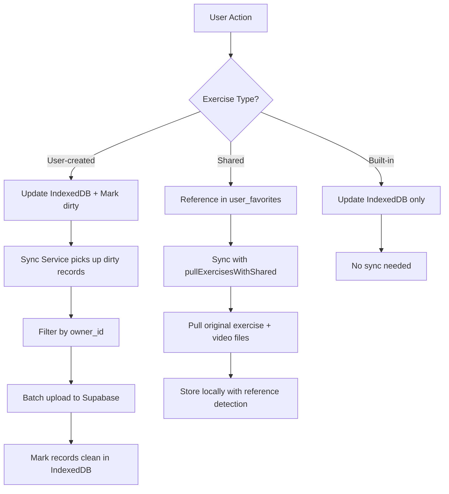

# Exercise Management & Sync Architecture

This document explains how RepCue differentiates between built-in and user-created exercises, how the sync system handles each type, and how to manage built-in exercises in the future.

## Exercise Types Overview

RepCue has three distinct types of exercises:

1. **Built-in Exercises**: System-provided exercises that come with the app
2. **User-created Exercises**: Custom exercises created by users
3. **Shared Exercises**: Exercises shared by other users (reference-based system)

These are differentiated at all layers of the application to ensure proper data management and sync behavior.

## ID Differentiation

### Built-in Exercises
- **ID Format**: Slug-based IDs (e.g., `"pushups"`, `"mountain-climbers"`, `"plank"`)
- **Pattern**: Human-readable strings without dashes or underscores in most cases
- **Detection**: Any ID that does NOT match the UUID v4 pattern

### User-created Exercises
- **ID Format**: UUID v4 (e.g., `"550e8400-e29b-41d4-a716-446655440000"`)
- **Pattern**: `^[0-9a-f]{8}-[0-9a-f]{4}-[0-9a-f]{4}-[0-9a-f]{4}-[0-9a-f]{12}$` (case-insensitive)
- **Generation**: Created using `crypto.randomUUID()`

### Shared Exercises
- **ID Format**: UUID v4 (same as user-created, since they reference original exercises)
- **Detection**: Identified via `user_favorites` table with `exercise_type: 'shared'`
- **Ownership**: Remain owned by original creator, accessed via reference

```typescript
// Detection logic in code:
const isUserCreated = exerciseId.match(/^[0-9a-f]{8}-[0-9a-f]{4}-[0-9a-f]{4}-[0-9a-f]{4}-[0-9a-f]{12}$/i);
const isBuiltIn = !isUserCreated;
```

## Database Layer

### IndexedDB Storage (via Dexie)
Both exercise types are stored in the same `exercises` table but with different metadata:

#### Built-in Exercises
```typescript
{
  id: "pushups",                    // Slug ID
  name: "Push-ups",
  // ... exercise properties
  owner_id: null,                   // Always null
  dirty: 0,                         // Always 0 (never synced)
  version: 1,                       // Fixed version
  op: "seed",                       // Operation type
  created_at: "2025-01-01T00:00:00.000Z",
  updated_at: "2025-01-01T00:00:00.000Z",
  deleted: false                    // Never soft-deleted
}
```

#### User-created Exercises
```typescript
{
  id: "550e8400-e29b-41d4-a716-446655440000", // UUID
  name: "My Custom Exercise",
  // ... exercise properties  
  owner_id: "user-uuid-here",       // User's ID
  dirty: 1,                         // 1 when needs sync, 0 when clean
  version: 1,                       // Incremented on updates
  op: "insert|update|delete",       // Last operation
  created_at: "2025-01-07T10:30:00.000Z",
  updated_at: "2025-01-07T11:45:00.000Z", 
  deleted: true                     // true for soft-deletes
}
```

### Supabase Database
- **Built-in exercises**: NEVER stored or synced to Supabase
- **User-created exercises**: Synced with full CRUD operations

## Sync System Behavior

### Built-in Exercises
- **Never synced**: `dirty` always remains `0`
- **Never uploaded**: Filtered out of all sync operations
- **Catalog managed**: Updated from `src/data/exercises.ts` during app lifecycle
- **No ownership**: `owner_id` is always `null`
- **No tombstones**: Hard deleted when removed from catalog

### User-created Exercises
- **Dirty flagging**: `dirty: 1` when created/updated/deleted
- **Ownership required**: Must have valid `owner_id`
- **Sync batching**: Processed in batches of 5 to avoid edge function timeouts
- **Soft deletes**: `deleted: true` creates tombstone records
- **Version control**: `version` field tracks changes

### Shared Exercises
- **Reference-based**: No duplication, stored in `user_favorites` table
- **Special sync handling**: `pullExercisesWithShared()` and `pullVideoFilesWithShared()` functions
- **Dual sync**: Syncs both user's own exercises AND shared exercise references
- **Video access**: Uses `download-shared-video` edge function for permission-based video access
- **UI integration**: `useSharedExercises` hook provides shared exercise detection

## Sync Flow



## Built-in Exercise Management

### File Location
Built-in exercises are defined in: `apps/frontend/src/data/exercises.ts`

```typescript
export const INITIAL_EXERCISES: Exercise[] = [
  {
    id: "pushups",
    name: "Push-ups",
    category: "strength",
    catalog_id: "general-fitness", // Multi-catalog system
    // ... other properties
  },
  // ... more exercises
];

export const EXERCISE_CATALOGS: ExerciseCatalog[] = [
  {
    id: "general-fitness",
    nameKey: "catalog.generalFitness.name",
    descriptionKey: "catalog.generalFitness.description",
    // ... catalog properties
  },
  // ... more catalogs
];
```

### Catalog Synchronization
The system now uses a multi-catalog approach with the following synchronization:

#### Exercise Catalogs (`StorageService.ensureCatalogsSeeded()`)
1. **Seed catalogs**: Ensure all exercise catalogs from `EXERCISE_CATALOGS` are in IndexedDB
2. **Update metadata**: Sync catalog names, descriptions, and i18n keys
3. **Clean obsolete**: Remove catalogs no longer in the system

#### Built-in Exercises (`StorageService.cleanBuiltInExercises()`)
1. **Clean existing**: Reset any dirty built-in exercises to clean state
2. **Remove obsolete**: Delete built-in exercises no longer in catalog
3. **Add new**: Insert new built-in exercises from catalog
4. **Catalog assignment**: Ensure all exercises have proper `catalog_id` references

### Adding Built-in Exercises

1. Add the new exercise to `INITIAL_EXERCISES` in `src/data/exercises.ts`:
```typescript
{
  id: "new-exercise",              // Use slug ID
  name: "New Exercise",
  category: "core",
  exercise_type: "repetition_based",
  // ... required fields
}
```

2. If exercise has video, add media entry to `public/exercise_media.json`:
```json
{
  "new-exercise": {
    "video": {
      "sources": [
        {
          "src": "/videos/new-exercise-480p.mp4",
          "type": "video/mp4",
          "quality": "480p"
        }
      ]
    }
  }
}
```

3. The exercise will automatically appear for all users on next app load

### Updating Built-in Exercises

1. Modify the exercise in `INITIAL_EXERCISES`
2. Users will get the updated version on next app load
3. **Note**: Changes overwrite any local modifications

### Removing Built-in Exercises

1. Remove from `INITIAL_EXERCISES` array
2. Remove associated media from `public/exercise_media.json`
3. Remove video files from `public/videos/` if no longer needed
4. Exercise will be deleted from all users' IndexedDB on next app load

## Security & Data Integrity

### Ownership Validation
```typescript
// User can only modify their own exercises
private validateOwnership(exerciseId: string, userId: string): boolean {
  // Built-in exercises: no ownership validation needed
  if (!this.isUserCreatedExercise(exerciseId)) {
    return false; // Cannot modify built-in exercises
  }
  
  // User exercises: must match owner
  return exercise.owner_id === userId;
}
```

### Sync Filtering
```typescript
// Only sync user-created exercises owned by current user
const dirtyExercises = await this.db.exercises
  .filter(exercise => 
    exercise.dirty === 1 && 
    exercise.owner_id === userId &&
    this.isUserCreatedExercise(exercise.id)
  )
  .limit(5)
  .toArray();
```

## Troubleshooting

### Common Issues

1. **Built-in exercises marked as dirty**
   - **Cause**: Improper initialization or data corruption
   - **Fix**: `cleanBuiltInExercises()` method will reset them

2. **Sync not processing user exercises**
   - **Check**: Authentication state (`user.id` available)
   - **Check**: Exercise has proper `owner_id` and UUID format
   - **Check**: Exercise is marked `dirty: 1`

3. **Exercise appears in IndexedDB but not Supabase**
   - **Check**: Sync service logs for errors
   - **Check**: Network connectivity
   - **Check**: Exercise batch limits (max 5 per sync)

### Debug Commands

```typescript
// Check exercise type
const isUserCreated = exerciseId.match(/^[0-9a-f]{8}-[0-9a-f]{4}-[0-9a-f]{4}-[0-9a-f]{4}-[0-9a-f]{12}$/i);

// Count dirty exercises by type
const dirtyBuiltIn = await db.exercises.filter(ex => ex.dirty === 1 && !isUserCreatedExercise(ex.id)).count();
const dirtyUserCreated = await db.exercises.filter(ex => ex.dirty === 1 && isUserCreatedExercise(ex.id)).count();
```

## Migration Considerations

When updating this system:

1. **ID Format Changes**: Would require data migration - avoid if possible
2. **Catalog Structure**: Changes to `INITIAL_EXERCISES` automatically propagate
3. **Sync Logic**: Changes to sync filtering require thorough testing
4. **Database Schema**: IndexedDB schema changes need migration strategy

This architecture ensures clear separation of concerns while maintaining data integrity and proper sync behavior for both exercise types.