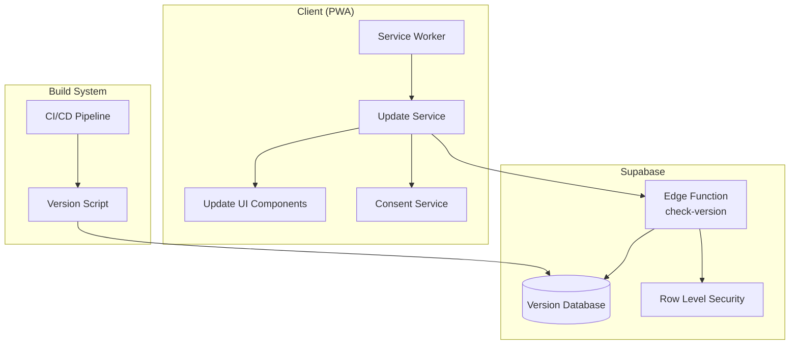
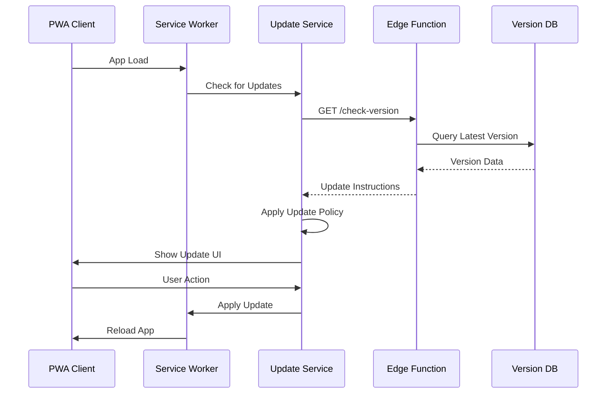

# Design Document

## Overview

The PWA Update System for RepCue implements a comprehensive, database-driven approach to managing application updates while maintaining the app's offline-first and privacy-first principles. The system combines standard PWA service worker update mechanisms with a Supabase-powered version management system that provides granular control over update policies, rollout strategies, and user experience.

The design leverages RepCue's existing serverless architecture with Supabase edge functions to provide intelligent update management without requiring a dedicated backend server. The system respects user consent preferences and provides seamless update experiences that don't interrupt active workouts.

## Architecture

### High-Level Architecture



### Update Flow Architecture



## Components and Interfaces

### 1. Database Schema

#### Version Management Table
```sql
CREATE TABLE app_versions (
    id UUID PRIMARY KEY DEFAULT gen_random_uuid(),
    version_number TEXT NOT NULL UNIQUE,
    build_number TEXT NOT NULL,
    release_date TIMESTAMPTZ NOT NULL DEFAULT NOW(),
    reviewer TEXT NOT NULL,
    git_commit_hash TEXT,
    update_policy TEXT NOT NULL CHECK (update_policy IN ('force', 'critical', 'optional')),
    changelog JSONB,
    metadata JSONB,
    is_active BOOLEAN NOT NULL DEFAULT true,
    created_at TIMESTAMPTZ NOT NULL DEFAULT NOW(),
    updated_at TIMESTAMPTZ NOT NULL DEFAULT NOW()
);

-- Indexes for performance
CREATE INDEX idx_app_versions_active ON app_versions (is_active, release_date DESC);
CREATE INDEX idx_app_versions_policy ON app_versions (update_policy, is_active);

-- RLS Policies (read-only for authenticated users, admin write access)
ALTER TABLE app_versions ENABLE ROW LEVEL SECURITY;

CREATE POLICY "Allow read access to active versions" ON app_versions
    FOR SELECT USING (is_active = true);
```

#### Version Audit Table
```sql
CREATE TABLE version_audit (
    id UUID PRIMARY KEY DEFAULT gen_random_uuid(),
    version_id UUID REFERENCES app_versions(id),
    action TEXT NOT NULL,
    changed_by TEXT NOT NULL,
    changes JSONB,
    created_at TIMESTAMPTZ NOT NULL DEFAULT NOW()
);
```

### 2. Edge Function: check-version

**Location**: `supabase/functions/check-version/index.ts`

```typescript
interface VersionCheckRequest {
    current_version: string;
    client_id?: string;
    user_consent?: boolean;
}

interface VersionCheckResponse {
    update_available: boolean;
    latest_version?: string;
    update_policy?: 'force' | 'critical' | 'optional';
    changelog?: any;
    download_url?: string;
    force_update?: boolean;
}
```

**Key Responsibilities**:
- Query version database for latest active version
- Compare with client's current version
- Return appropriate update instructions based on policy
- Respect privacy preferences (no tracking without consent)
- Handle offline fallback scenarios

### 3. Frontend Update Service

**Location**: `apps/frontend/src/services/updateService.ts`

```typescript
interface UpdateService {
    checkForUpdates(): Promise<UpdateInfo | null>;
    applyUpdate(policy: UpdatePolicy): Promise<void>;
    getUserPreferences(): UpdatePreferences;
    setUserPreferences(prefs: UpdatePreferences): void;
    showUpdateNotification(info: UpdateInfo): void;
    handleForceUpdate(info: UpdateInfo): void;
}

interface UpdateInfo {
    version: string;
    policy: 'force' | 'critical' | 'optional';
    changelog: any;
    releaseDate: string;
    downloadSize?: number;
}

interface UpdatePreferences {
    updateMode: 'automatic' | 'notify' | 'manual';
    allowMeteredUpdates: boolean;
    showChangelog: boolean;
}
```

### 4. Service Worker Integration

**Enhancement to existing Vite PWA configuration**:

```typescript
// Enhanced service worker registration
if ('serviceWorker' in navigator) {
    navigator.serviceWorker.register('/sw.js').then(registration => {
        // Listen for updates
        registration.addEventListener('updatefound', () => {
            updateService.handleServiceWorkerUpdate(registration);
        });
    });
}
```

### 5. Update UI Components

#### UpdateNotificationBanner
- Non-intrusive notification for optional/critical updates
- Respects user preferences for timing and frequency
- Integrates with existing RepCue design system

#### ForceUpdateModal
- Blocking modal for force policy updates
- Clear security messaging
- Progress indicator during update
- Handles workout interruption gracefully

#### UpdatePreferencesPanel
- Settings integration for user preferences
- Clear explanations of each update mode
- Privacy-focused messaging

## Data Models

### Version Data Structure
```typescript
interface AppVersion {
    id: string;
    version_number: string;
    build_number: string;
    release_date: string;
    reviewer: string;
    git_commit_hash?: string;
    update_policy: 'force' | 'critical' | 'optional';
    changelog: {
        new_features?: string[];
        improvements?: string[];
        bug_fixes?: string[];
        security_updates?: string[];
    };
    metadata: {
        download_size?: number;
        compatibility_notes?: string;
        rollback_version?: string;
    };
    is_active: boolean;
}
```

### Update State Management
```typescript
interface UpdateState {
    currentVersion: string;
    latestVersion?: string;
    updateAvailable: boolean;
    updatePolicy?: UpdatePolicy;
    isUpdating: boolean;
    updateProgress?: number;
    lastCheckTime?: Date;
    userPreferences: UpdatePreferences;
    pendingUpdate?: UpdateInfo;
}
```

## Error Handling

### Update Failure Recovery
1. **Network Failures**: Graceful degradation to service worker-only updates
2. **Download Failures**: Retry mechanism with exponential backoff
3. **Installation Failures**: Automatic rollback to previous version
4. **Database Unavailable**: Fall back to local version checking

### User Experience During Errors
- Clear error messaging with actionable steps
- Option to retry or defer update
- Maintain app functionality during non-critical failures
- Emergency contact information for force update failures

### Logging and Monitoring
```typescript
interface UpdateEvent {
    type: 'check' | 'download' | 'install' | 'error';
    version: string;
    timestamp: Date;
    error?: string;
    metadata?: any;
}
```

## Testing Strategy

### Unit Testing
- **Update Service**: Mock edge function responses, test policy logic
- **UI Components**: Test notification display, user interactions
- **Service Worker**: Test update detection and installation
- **Edge Function**: Test version comparison logic, database queries

### Integration Testing
- **End-to-End Update Flow**: From version check to app reload
- **Offline Scenarios**: Test fallback mechanisms
- **Cross-Browser Compatibility**: Ensure consistent behavior
- **Network Conditions**: Test on slow/metered connections

### User Acceptance Testing
- **Update Notification UX**: Test with different user preferences
- **Force Update Experience**: Ensure clear messaging and smooth flow
- **Workout Interruption**: Test update handling during active sessions
- **Accessibility**: Screen reader compatibility, keyboard navigation

### Performance Testing
- **Update Check Frequency**: Optimize to minimize battery/data usage
- **Download Size Impact**: Test with various update sizes
- **Memory Usage**: Ensure updates don't cause memory issues
- **Startup Performance**: Verify update checks don't slow app launch

## Privacy and Security Considerations

### Privacy-First Design
- **No Tracking**: Version checks don't transmit personal data
- **Consent Respect**: Honor user's cloud sync consent preferences
- **Local Storage**: Update preferences stored locally
- **Minimal Data**: Only version numbers and policies transmitted

### Security Measures
- **RLS Policies**: Database access controlled via Row Level Security
- **Input Validation**: All version data validated before processing
- **Secure Transmission**: HTTPS for all update communications
- **Integrity Checks**: Verify update authenticity before installation

### Force Update Security
- **Clear Messaging**: Explain why immediate update is required
- **Audit Trail**: Log all force update deployments
- **Rollback Capability**: Quick rollback for problematic updates
- **Emergency Procedures**: Manual override for critical issues

## Development Workflow Integration

### Version Management Process
1. **Development**: Create version entry in dev database
2. **Testing**: Validate update flow in dev environment
3. **Staging**: Test with production-like data
4. **Production**: Deploy migrations and edge functions together

### CI/CD Integration
```bash
# Build-time version injection
npm run build:prod
# Creates version entry with build metadata
node scripts/create-version-entry.js
# Deploy edge functions
supabase functions deploy check-version
# Apply database migrations
supabase db push
```

### Migration Strategy
- **Schema Changes**: Version controlled in `supabase/migrations/`
- **Edge Function Updates**: Deployed atomically with database changes
- **Rollback Plan**: Maintain previous version entries for quick rollback
- **Environment Parity**: Ensure dev/prod consistency