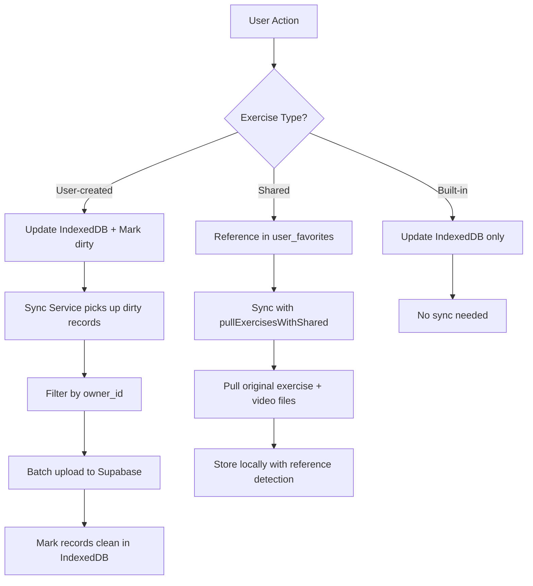

# The RepCue Sync System: Complete Developer Guide

This comprehensive guide covers RepCue's offline-first synchronization architecture, including data sync, exercise sharing, video uploads, and cross-device functionality.

## Table of Contents

1. [System Overview](#system-overview)
2. [Architecture Components](#architecture-components)
3. [Data Types and Exercise Management](#data-types-and-exercise-management)
4. [Core Sync Engine (v2)](#core-sync-engine-v2)
5. [Exercise Sharing System](#exercise-sharing-system)
6. [Video Upload and Sync](#video-upload-and-sync)
7. [Favorites and Preferences Sync](#favorites-and-preferences-sync)
8. [Database Schema](#database-schema)
9. [Security and Access Control](#security-and-access-control)
10. [Development Guide](#development-guide)
11. [Troubleshooting](#troubleshooting)

---

## System Overview

RepCue implements an **offline-first synchronization architecture** that ensures users can access and modify their data without internet connectivity while seamlessly syncing across devices when online.

### Core Principles

- **Offline-First**: All data lives primarily in IndexedDB. Sync augments, never blocks core UX
- **User Consent**: Sync is opt-in, requiring explicit user consent and authentication
- **Reference-Based Sharing**: Shared exercises use references, not duplication, maintaining data integrity
- **Conflict Resolution**: Version-based with timestamp tiebreakers for deterministic outcomes
- **Gradual Consistency**: Changes propagate eventually across devices without blocking user actions

### Key Features

- **Immediate Local Access**: Users see changes instantly, even offline
- **Cross-Device Sync**: Data synchronizes across all authenticated devices
- **Exercise Sharing**: Reference-based system for sharing exercises between users
- **Video Support**: Offline-first video upload and cross-device access
- **Favorites & Preferences**: Bidirectional sync of user settings and favorites
- **Conflict Resolution**: Automatic resolution of concurrent edits

---

## Architecture Components

### Client-Side (Frontend)

| Component | Location | Responsibility |
|-----------|----------|----------------|
| **CorrectSyncService** | `src/services/correctSyncService.ts` | Core sync orchestration, batching, conflict resolution |
| **StorageService** | `src/services/storageService.ts` | IndexedDB CRUD operations, dirty marking, tombstones |
| **SyncService** | `src/services/syncService.ts` | Legacy interface wrapper for backward compatibility |
| **useSharedExercises** | `src/hooks/useSharedExercises.ts` | Hook for detecting shared exercises in UI |

### Server-Side (Supabase)

| Component | Location | Responsibility |
|-----------|----------|----------------|
| **sync_v2 Edge Function** | `supabase/functions/sync_v2/index.ts` | Main sync endpoint with per-table pagination |
| **save-shared-exercise** | `supabase/functions/save-shared-exercise/` | Creates exercise references for sharing |
| **get-shared-exercise** | `supabase/functions/get-shared-exercise/` | Anonymous access to shared exercises |
| **download-shared-video** | `supabase/functions/download-shared-video/` | Permission-based video access |
| **RLS Policies** | Database | Row-level security for data isolation |

### Data Layer

| Component | Purpose |
|-----------|---------|
| **IndexedDB (Dexie)** | Primary local storage for all user data |
| **Supabase Database** | Cloud storage with PostgreSQL backend |
| **Supabase Storage** | Binary file storage for videos |

---

## Data Types and Exercise Management

RepCue handles three distinct types of exercises, each with different sync behaviors:

### Exercise Types

#### 1. Built-in Exercises
- **ID Format**: Slug-based (e.g., `"pushups"`, `"plank"`)
- **Source**: Defined in `src/data/exercises.ts`
- **Sync Behavior**: Never synced to server
- **Ownership**: `owner_id` always `null`
- **Management**: Updated through app releases

```typescript
// Detection logic
const isBuiltIn = !exerciseId.match(/^[0-9a-f]{8}-[0-9a-f]{4}-[0-9a-f]{4}-[0-9a-f]{4}-[0-9a-f]{12}$/i);
```

#### 2. User-Created Exercises
- **ID Format**: UUID v4 (e.g., `"550e8400-e29b-41d4-a716-446655440000"`)
- **Source**: Created by users in the app
- **Sync Behavior**: Full CRUD sync with server
- **Ownership**: `owner_id` = authenticated user
- **Management**: Synced via `exercises` table

#### 3. Shared Exercises
- **ID Format**: UUID v4 (references original exercise)
- **Source**: Exercises shared by other users
- **Sync Behavior**: Reference-based via `user_favorites` table
- **Ownership**: Remains with original creator
- **Management**: Special handling in sync engine

### Exercise Sync Flow



---

## Core Sync Engine (v2)

The v2 sync engine (`CorrectSyncService`) provides robust, efficient synchronization with the following characteristics:

### Sync Modes

| Mode | Tables Synced | Use Case | Frequency |
|------|---------------|----------|-----------|
| **Light** | `user_preferences`, `app_settings`, `exercises`, `user_favorites` + dirty tables | Background sync | Every 10s (if changes) |
| **Full** | All sync tables | Login, manual force, long intervals | On-demand |
| **Priority** | Tables affected by user mutation | Immediate push after user action | Real-time |

### Per-Table Cursor System

Each table maintains its own cursor for deterministic pagination:

```typescript
interface TableCursor {
  lastUpdatedAt: string;  // Timestamp of last synced record
  lastId: string;         // ID of last synced record for tie-breaking
}
```

**Server Query Pattern**:
```sql
SELECT * FROM table
WHERE (updated_at > $lastUpdatedAt)
   OR (updated_at = $lastUpdatedAt AND id > $lastId)
ORDER BY updated_at ASC, id ASC
LIMIT 51; -- 50 + 1 for "more" detection
```

### Conflict Resolution

The sync engine uses a **version-first** approach with timestamp tiebreakers:

| Scenario | Local Version | Server Version | Result |
|----------|---------------|----------------|---------|
| Local newer | 5 | 3 | Keep local (will push later) |
| Server newer | 3 | 5 | Accept server update |
| Same version | 3 | 3 | Compare `updated_at` timestamps |
| Tie-breaker | Same timestamp | Same timestamp | Compare record IDs |

### Batch Processing

- **Push Limit**: Maximum 5 records per sync request
- **Pull Limit**: 50 records per page, maximum 5 pages per table
- **Security**: Payload size capped at 32KB
- **Ownership**: Server enforces `owner_id` = authenticated user

### Backoff Strategy

```typescript
// Exponential backoff with jitter
const backoffSeconds = Math.min(60, Math.pow(2, consecutiveFailures)) * (0.8 + Math.random() * 0.4);

// Backoff schedule: 1s → 2s → 4s → 8s → 16s → 32s → 60s (max)
```

### Table Sync Order

```typescript
const SYNC_ORDER = [
  'user_preferences',    // User settings and built-in exercise favorites
  'app_settings',        // Application preferences
  'exercise_catalogs',   // Must sync before exercises (foreign key)
  'exercises',           // User-created exercises
  'user_favorites',      // Shared exercise references
  'workouts',           // User-created workouts
  'activity_logs',      // Exercise history
  'workout_sessions',   // Workout tracking
  'video_files'         // Custom video uploads
];
```

---

## Exercise Sharing System

RepCue implements a **reference-based sharing system** that maintains data integrity while enabling seamless exercise sharing between users.

### Sharing Architecture

#### Reference-Based Approach
- **No Exercise Duplication**: Shared exercises remain owned by original creator
- **Reference Storage**: Recipients get entries in `user_favorites` table
- **Update Propagation**: Changes by creator automatically appear for all users
- **Centralized Statistics**: Likes, shares, and ratings stay with original exercise

#### Sharing Flow

```
1. USER CREATES SHARE
   ↓
   ShareButton → share-exercise Edge Function
   ↓
   Generate token → Store in exercise_shares table
   ↓
   Return share URL: /share/{token}

2. RECIPIENT ACCESSES LINK
   ↓
   Browser loads /share/{token} → StandaloneSharedExercise.tsx
   ↓
   Extract token → Call get-shared-exercise?token={token}
   ↓
   Validate token → Fetch exercise data → Generate video signed URL
   ↓
   Display exercise with temporary video access

3. SAVE TO LIBRARY (Reference-Based)
   ↓
   save-shared-exercise → Create reference in user_favorites table
   ↓
   Sync engine pulls shared exercises via pullExercisesWithShared()
```

### Technical Implementation

#### Database Tables

**exercise_shares**: Share tokens and permissions
```sql
CREATE TABLE exercise_shares (
  id UUID PRIMARY KEY DEFAULT gen_random_uuid(),
  exercise_id UUID REFERENCES exercises(id),
  owner_id UUID REFERENCES profiles(id),
  share_token TEXT UNIQUE,              -- 64-character hex
  permission_level VARCHAR DEFAULT 'view',
  expires_at TIMESTAMPTZ,               -- Optional expiry
  created_at TIMESTAMPTZ DEFAULT NOW(),
  deleted BOOLEAN DEFAULT false
);
```

**user_favorites**: Shared exercise references
```sql
CREATE TABLE user_favorites (
  id UUID PRIMARY KEY DEFAULT gen_random_uuid(),
  owner_id UUID REFERENCES profiles(id),   -- Recipient user
  item_id UUID,                            -- Original exercise ID
  item_type VARCHAR DEFAULT 'exercise',
  exercise_type VARCHAR,                   -- 'shared' for shared exercises
  created_at TIMESTAMPTZ DEFAULT NOW(),
  deleted BOOLEAN DEFAULT false
);
```

#### Sync Integration

The sync engine includes special handling for shared exercises:

```typescript
// Enhanced sync function for exercises
async function pullExercisesWithShared(supabase, userId, cursor, limit, correlationId) {
  // 1. Pull user's own exercises
  const ownExercises = await pullUserExercises(userId, cursor, limit);

  // 2. Get shared exercise references from user_favorites
  const sharedRefs = await getSharedExerciseRefs(userId);

  // 3. Pull original exercises for valid references
  const sharedExercises = await pullOriginalExercises(sharedRefs);

  // 4. Combine and return unified exercise list
  return combineExercises(ownExercises, sharedExercises);
}
```

#### UI Integration

The `useSharedExercises` hook provides shared exercise detection:

```typescript
const { isSharedExercise, sharedExerciseIds } = useSharedExercises();

// Usage in components
const showSharedBadge = isSharedExercise(exercise.id);
const canEdit = !isSharedExercise(exercise.id) && exercise.owner_id === user.id;
```

---

## Video Upload and Sync

RepCue implements **offline-first video handling** that allows immediate local access while syncing to cloud storage in the background.

**Storage Configuration**: All videos are stored exclusively in the `exercise-videos` bucket for simplified architecture and consistent management. The system underwent a complete cleanup in September 2025, removing all legacy data from both buckets and eliminating the dual-bucket complexity that previously existed.

### Video Flow Overview

```
User Upload → IndexedDB (immediate) → Sync Service → Cloud Storage → Cross-Device Access
     ↓               ↓                     ↓              ↓              ↓
  Instant       Local Playback      Background Sync   Permanent URL   All Devices
```

### Upload Process

#### Phase 1: Local Storage (Immediate)
1. **File Validation**: MP4, WebM, OGV formats supported
2. **Singleton Enforcement**: Delete existing video for exercise
3. **IndexedDB Storage**: Store File object as Blob
4. **URL Generation**: Create `blob-pending-sync://exerciseId/fileName.mp4`
5. **Immediate Playback**: Video available offline instantly

#### Phase 2: Cloud Sync (Background)
1. **Data Preparation**: Convert File → ArrayBuffer → Uint8Array
2. **Batch Upload**: Include in sync payload as byte array
3. **Server Processing**: Edge function uploads to Supabase Storage
4. **Path Generation**: `userId/exerciseId/fileName.mp4`
5. **Database Update**: Mark `upload_pending: false`, set `storage_path`
6. **URL Scheme Update**: Change exercise's `custom_video_url` from `blob-pending-sync://` to `blob-video://` to indicate sync completion

#### Phase 3: Cross-Device Access
1. **Sync Propagation**: Other devices receive video file records
2. **Download Trigger**: `downloadVideoFileForOfflineAccess()` called
3. **Storage Access**: Direct download for owned videos
4. **Local Caching**: Store in IndexedDB for offline access
5. **URL Resolution**: Create blob URLs for video players

### Shared Video Access

Shared exercises require special video handling due to ownership:

```typescript
// Video access logic
const isSharedExercise = !storagePath.startsWith(currentUserId);

if (isSharedExercise) {
  // Use edge function for permission-based access
  const response = await fetch('/functions/v1/download-shared-video', {
    method: 'POST',
    headers: { 'Authorization': `Bearer ${session.access_token}` },
    body: JSON.stringify({
      exerciseId: videoFile.exercise_id,
      originalExerciseId: pathParts[1],
      originalOwnerId: pathParts[0]
    })
  });

  // Important: Use fetch().blob() to preserve binary data
  const videoBlob = await response.blob();
} else {
  // Direct storage access for own videos
  const { data } = await supabase.storage.from('exercise-videos').download(storagePath);
}
```

### Video Data Transformations

```
User File (File object)
    ↓
IndexedDB (Blob storage)
    ↓
Sync Client (ArrayBuffer → Uint8Array → byte array)
    ↓
Network Transfer (JSON with byte array)
    ↓
Edge Function (byte array → Uint8Array)
    ↓
Supabase Storage (binary file)
    ↓
Download Response (Blob via fetch().blob())
    ↓
IndexedDB (File object recreation)
    ↓
Video Player (blob URL)
```

### Video URL Schemes

RepCue uses custom URL schemes to track video sync status:

| URL Scheme | Meaning | UI Behavior | When Used |
|------------|---------|-------------|-----------|
| `blob-pending-sync://exerciseId/fileName.mp4` | Video stored locally, not yet synced to cloud | Shows "Video ready offline - will sync when online" message | Immediately after user upload, before sync completes |
| `blob-video://exerciseId/fileName.mp4` | Video stored locally AND synced to cloud | No pending message, shows "Local video (synced)" status | After successful cloud upload |
| `http://` or `https://` | Direct URL to cloud storage | Standard video player behavior | Fallback for legacy or external videos |

**URL Lifecycle**:
```
User Upload → blob-pending-sync:// → [Sync Success] → blob-video://
                                   ↓
                            [IndexedDB stores File object]
                                   ↓
                            [Video player uses blob URL]
```

**Implementation Notes**:
- Both `blob-pending-sync://` and `blob-video://` URLs trigger IndexedDB lookup to create actual `blob:` URLs for the video player
- The URL scheme is purely for status tracking - the actual video playback always uses IndexedDB-stored File objects converted to blob URLs
- On other devices, videos with `blob-video://` URLs trigger automatic download from cloud storage to IndexedDB

### Critical Implementation Notes

#### Video Corruption Prevention
- **Always use `fetch().blob()`** for video downloads, never `supabase.functions.invoke()`
- The Supabase SDK incorrectly parses binary data as UTF-8, causing corruption
- Direct fetch preserves byte-for-byte integrity

#### Singleton Pattern
- One video per exercise maximum
- Prevents storage bloat and simplifies UX
- Enforced both client-side and server-side

---

## Favorites and Preferences Sync

RepCue implements a two-tiered favorite system to handle both built-in and user-created exercises appropriately.

### Two-Tiered Favorite System

#### Built-in Exercise Favorites (Slug IDs)
- **Storage**: `user_preferences.favorite_exercises` array
- **Sync Table**: `user_preferences`
- **Logic**: Simple array of slug IDs (e.g., `["pushups", "plank"]`)
- **Rationale**: Cannot use `user_favorites` table due to UUID constraint

#### User-Created Exercise Favorites (UUID IDs)
- **Storage**: `user_favorites` table with `item_type: 'exercise'`
- **Sync Table**: `user_favorites`
- **Logic**: Individual records with proper foreign key relationships
- **Rationale**: Supports relational integrity and complex querying

### Implementation

```typescript
// Favorite toggle logic in App.tsx
const toggleExerciseFavorite = async (exerciseId: string) => {
  const isUserCreated = /^[0-9a-f]{8}-[0-9a-f]{4}-[0-9a-f]{4}-[0-9a-f]{4}-[0-9a-f]{12}$/i.test(exerciseId);

  if (isUserCreated) {
    // Use user_favorites table for UUID exercises
    await favoritesService.toggleFavorite(exerciseId, 'exercise', 'user_created');
  } else {
    // Use user_preferences array for built-in exercises
    await storageService.toggleExerciseFavorite(exerciseId);
  }
};
```

### Settings Sync

App settings require field mapping between client and server schemas:

#### Field Mappings

**AppSettings (Client) ↔ app_settings (Supabase)**
```typescript
// Client → Server mapping
{
  interval_duration: 'beep_interval_seconds',
  sound_enabled: 'beep_sound_enabled',
  beep_volume: 'beep_volume',
  vibration_enabled: 'vibration_enabled',
  dark_mode: 'dark_mode',
  reduce_motion: 'reduce_motion',
  auto_start_next: 'auto_start_next',
  pre_timer_countdown: 'pre_timer_countdown',
  show_exercise_videos: 'show_exercise_videos',
  auto_save: 'data_auto_save',
  default_rest_time: 'default_rest_time'
}
```

**UserPreferences (Client) ↔ user_preferences (Supabase)**
```typescript
// Direct mapping (no conversion needed)
{
  locale: 'locale',
  units: 'units',
  rep_speed_factor: 'rep_speed_factor',
  cues: 'cues',
  favorite_exercises: 'favorite_exercises'
}
```

---

## Database Schema

### Core Sync Tables

All syncable tables follow a consistent pattern with these required fields:

```sql
-- Standard sync metadata columns
id              UUID PRIMARY KEY DEFAULT gen_random_uuid(),
owner_id        UUID REFERENCES auth.users(id),
created_at      TIMESTAMPTZ DEFAULT NOW(),
updated_at      TIMESTAMPTZ DEFAULT NOW(),
version         INTEGER DEFAULT 1,
deleted         BOOLEAN DEFAULT false
```

### Primary Tables

#### exercises
```sql
CREATE TABLE exercises (
  id UUID PRIMARY KEY,
  name TEXT NOT NULL,
  description TEXT,
  category TEXT NOT NULL,
  exercise_type TEXT CHECK (exercise_type IN ('time_based', 'repetition_based')),
  instructions JSONB DEFAULT '[]',
  rep_duration_seconds NUMERIC,
  is_favorite BOOLEAN DEFAULT false,
  owner_id UUID REFERENCES auth.users(id),

  -- Multi-catalog support
  catalog_id TEXT REFERENCES exercise_catalogs(id),

  -- Video support
  custom_video_url TEXT,
  has_video BOOLEAN DEFAULT false,

  -- Exercise metadata
  default_duration NUMERIC,
  default_sets INTEGER,
  default_reps INTEGER,
  difficulty_level VARCHAR DEFAULT 'beginner',
  equipment_needed TEXT[],
  muscle_groups TEXT[],
  tags TEXT[],

  -- Sharing metadata
  is_public BOOLEAN DEFAULT false,
  is_verified BOOLEAN DEFAULT false,
  rating_average NUMERIC DEFAULT 0,
  rating_count INTEGER DEFAULT 0,
  copy_count INTEGER DEFAULT 0,

  -- Standard sync fields
  created_at TIMESTAMPTZ DEFAULT NOW(),
  updated_at TIMESTAMPTZ DEFAULT NOW(),
  version INTEGER DEFAULT 1,
  deleted BOOLEAN DEFAULT false
);
```

#### user_favorites
```sql
CREATE TABLE user_favorites (
  id UUID PRIMARY KEY DEFAULT gen_random_uuid(),
  owner_id UUID REFERENCES auth.users(id),
  item_id TEXT NOT NULL,                    -- Exercise ID (UUID or slug)
  item_type VARCHAR DEFAULT 'exercise',     -- Type of favorited item
  exercise_type VARCHAR DEFAULT 'builtin',  -- 'builtin', 'user_created', 'shared'

  -- Standard sync fields
  created_at TIMESTAMPTZ DEFAULT NOW(),
  updated_at TIMESTAMPTZ DEFAULT NOW(),
  version INTEGER DEFAULT 1,
  deleted BOOLEAN DEFAULT false
);
```

#### video_files
```sql
CREATE TABLE video_files (
  id UUID PRIMARY KEY DEFAULT gen_random_uuid(),
  owner_id UUID REFERENCES auth.users(id),
  exercise_id UUID NOT NULL,
  file_name TEXT NOT NULL,
  file_data BYTEA,                    -- Local storage only (null after upload)
  file_size BIGINT NOT NULL,
  mime_type TEXT NOT NULL,
  upload_pending BOOLEAN DEFAULT true,
  storage_path TEXT,                  -- Path in Supabase Storage

  -- Standard sync fields
  created_at TIMESTAMPTZ DEFAULT NOW(),
  updated_at TIMESTAMPTZ DEFAULT NOW(),
  version INTEGER DEFAULT 1,
  deleted BOOLEAN DEFAULT false
);
```

#### exercise_shares
```sql
CREATE TABLE exercise_shares (
  id UUID PRIMARY KEY DEFAULT gen_random_uuid(),
  exercise_id UUID REFERENCES exercises(id),
  owner_id UUID REFERENCES auth.users(id),
  share_token TEXT UNIQUE,              -- 64-character hex string
  permission_level VARCHAR DEFAULT 'view',
  shared_with_user_id UUID REFERENCES auth.users(id),
  expires_at TIMESTAMPTZ,

  -- Standard fields
  created_at TIMESTAMPTZ DEFAULT NOW(),
  updated_at TIMESTAMPTZ DEFAULT NOW(),
  deleted BOOLEAN DEFAULT false,
  version BIGINT DEFAULT 1
);
```

### Indexes for Performance

```sql
-- Critical for sync pagination
CREATE INDEX idx_exercises_owner_updated_id ON exercises(owner_id, updated_at DESC, id);
CREATE INDEX idx_user_favorites_owner_updated_id ON user_favorites(owner_id, updated_at DESC, id);
CREATE INDEX idx_video_files_owner_updated_id ON video_files(owner_id, updated_at DESC, id);

-- For shared exercise lookups
CREATE INDEX idx_user_favorites_item_type ON user_favorites(owner_id, item_type, exercise_type) WHERE deleted = false;
CREATE INDEX idx_exercise_shares_token ON exercise_shares(share_token) WHERE deleted = false;
```

---

## Security and Access Control

### Row Level Security (RLS)

#### Exercise Access
```sql
-- Users can manage their own exercises
CREATE POLICY "Users can manage their own exercises" ON exercises
  FOR ALL TO authenticated
  USING (owner_id = auth.uid());

-- Public access for shared exercises (anonymous viewing)
CREATE POLICY "Public read access for shared exercises" ON exercises
  FOR SELECT TO anon, authenticated
  USING (id IN (
    SELECT exercise_id FROM exercise_shares
    WHERE share_token IS NOT NULL
    AND (expires_at IS NULL OR expires_at > now())
    AND deleted = false
  ));
```

#### Video File Access
```sql
-- Users can access their own video files
CREATE POLICY "Users can view their own video files" ON video_files
  FOR SELECT TO authenticated
  USING (owner_id = auth.uid());

-- Shared exercise video access (reference-based)
CREATE POLICY "Users can view video files for shared exercises" ON video_files
  FOR SELECT TO authenticated
  USING (EXISTS (
    SELECT 1 FROM user_favorites uf
    WHERE uf.owner_id = auth.uid()
    AND uf.item_id = video_files.exercise_id
    AND uf.item_type = 'exercise'
    AND uf.exercise_type = 'shared'
    AND uf.deleted = false
  ));
```

#### Storage Bucket Security
```sql
-- Users can only access their own video folders
CREATE POLICY "Users can download their own videos" ON storage.objects
  FOR SELECT TO authenticated
  USING (bucket_id = 'exercise-videos' AND auth.uid()::text = foldername(name)[1]);

-- No anonymous access to storage - requires signed URLs
```

### Edge Function Security

#### Field Allowlists
The sync_v2 edge function enforces strict field allowlists:

```typescript
const MUTABLE_FIELD_ALLOWLIST = {
  exercises: new Set([
    'id', 'name', 'description', 'category', 'exercise_type', 'instructions',
    'rep_duration_seconds', 'is_favorite', 'owner_id', 'created_at', 'updated_at',
    'version', 'deleted', 'is_public', 'is_verified', 'rating_average', 'rating_count',
    'copy_count', 'difficulty_level', 'equipment_needed', 'muscle_groups', 'tags',
    'custom_video_url', 'has_video', 'default_duration', 'default_sets', 'default_reps',
    'catalog_id', 'benefits', 'limitations', 'best_timing', 'suggested_combinations',
    'notes', 'exercise_references'
  ])
  // ... other tables
};
```

#### Ownership Enforcement
- Server overwrites `owner_id` with authenticated user ID
- Foreign-owned records are skipped during updates
- Batch size limited to 5 records maximum
- Payload size capped at 32KB

#### Token Security
- Share tokens use 256 bits of entropy (64-character hex)
- Cryptographically secure generation via `crypto.getRandomValues()`
- Database uniqueness constraint prevents collisions
- Optional expiration timestamps

---

## Development Guide

### Adding a New Syncable Entity

1. **Database Schema**
```sql
-- Add required sync columns
ALTER TABLE your_table ADD COLUMN version INTEGER DEFAULT 1;
ALTER TABLE your_table ADD COLUMN deleted BOOLEAN DEFAULT false;
ALTER TABLE your_table ADD COLUMN updated_at TIMESTAMPTZ DEFAULT NOW();
ALTER TABLE your_table ADD COLUMN owner_id UUID REFERENCES auth.users(id);

-- Add performance index
CREATE INDEX idx_your_table_owner_updated_id ON your_table(owner_id, updated_at DESC, id);
```

2. **Client-Side IndexedDB**
```typescript
// Add to Dexie schema
export interface YourEntity extends SyncMetadata {
  // your fields
  name: string;
  // ...
}

// Add table to schema
const db = new Dexie('RepCueDB');
db.version(X).stores({
  // existing tables...
  your_table: 'id, owner_id, updated_at, dirty'
});
```

3. **Sync Service Integration**
```typescript
// Add to SYNC_ORDER (mind dependencies)
const SYNC_ORDER = [
  'user_preferences',
  'app_settings',
  'exercise_catalogs',
  'exercises',
  'your_table',        // Add here
  'user_favorites',
  // ...
];
```

4. **Edge Function Updates**
```typescript
// Add to sync_v2 allowlist
const SYNC_TABLES = [
  // existing tables...
  'your_table'
];

const MUTABLE_FIELD_ALLOWLIST = {
  // existing allowlists...
  your_table: new Set([
    'id', 'owner_id', 'name', /* your fields */
    'created_at', 'updated_at', 'version', 'deleted'
  ])
};
```

5. **StorageService Methods**
```typescript
class StorageService {
  async saveYourEntity(entity: YourEntity): Promise<boolean> {
    try {
      await this.db.your_table.put({
        ...entity,
        dirty: 1,
        version: (entity.version || 0) + 1,
        updated_at: new Date().toISOString(),
        op: entity.id ? 'update' : 'insert'
      });
      return true;
    } catch (error) {
      logger.error('Failed to save entity:', error);
      return false;
    }
  }
}
```

### Testing Sync Features

#### Unit Tests
```typescript
describe('YourEntity Sync', () => {
  it('should mark entity as dirty when created', async () => {
    const entity = await storageService.saveYourEntity(newEntity);
    expect(entity.dirty).toBe(1);
    expect(entity.version).toBe(1);
  });

  it('should handle version conflicts correctly', async () => {
    // Test conflict resolution logic
  });
});
```

#### Integration Tests
```typescript
describe('Sync Integration', () => {
  it('should sync entity bidirectionally', async () => {
    // Create entity locally
    // Trigger sync
    // Verify server has entity
    // Modify on server
    // Trigger sync
    // Verify local has update
  });
});
```

### Debugging Sync Issues

#### Enable Debug Logging
```typescript
// In src/config/features.ts
export const SYNC_DEBUG = true;

// This enables detailed sync logging
logger.debug('[sync:v2] Processing table:', table);
logger.debug('[sync:v2] Conflict resolution:', { local, server, result });
```

#### Check Sync State
```typescript
// View current sync cursors
const syncState = await correctSyncService.getSyncState();
console.log('Per-table cursors:', syncState.perTable);
console.log('Last sync times:', {
  light: syncState.lastLightSyncAt,
  full: syncState.lastFullSyncAt
});
```

#### Monitor Edge Function Logs
```bash
# View edge function logs
supabase functions logs sync_v2 --follow

# Look for correlation IDs in logs
grep "correlation_id" logs.txt
```

---

## Troubleshooting

### Common Issues

#### Sync Not Working
**Symptoms**: Changes not appearing on other devices
**Diagnosis**:
1. Check authentication: `auth.getSession()`
2. Verify user consent: `consentService.hasConsent()`
3. Check network connectivity
4. Review sync state: `getSyncState()`
5. Look for backoff status

**Solutions**:
- Force full sync: Settings → Advanced → Force Full Sync
- Reset sync state: Settings → Advanced → Reset Sync State
- Check edge function logs for errors

#### Exercise Not Syncing
**Symptoms**: User-created exercise not appearing on server
**Diagnosis**:
1. Verify exercise has UUID format ID
2. Check `dirty: 1` flag in IndexedDB
3. Confirm `owner_id` matches authenticated user
4. Review sync batch limits (5 records max)

**Solutions**:
- Re-save exercise to mark dirty
- Check network connectivity
- Wait for next sync cycle

#### Shared Exercise Not Loading
**Symptoms**: Shared exercise appears but no content/video
**Diagnosis**:
1. Verify `user_favorites` reference exists
2. Check original exercise still exists
3. Confirm video file permissions
4. Review RLS policies

**Solutions**:
- Re-save shared exercise
- Check original exercise availability
- Verify sharing permissions

#### Video Corruption
**Symptoms**: Video files become unplayable after sharing
**Diagnosis**:
1. Check file size changes (corruption indicator)
2. Verify using `fetch().blob()` not `supabase.functions.invoke()`
3. Review video download pipeline

**Solutions**:
- Always use direct fetch for binary data
- Verify MIME types and file integrity
- Re-upload corrupted videos

### Performance Issues

#### Slow Sync Performance
**Causes**:
- Large batch sizes
- Network latency
- Complex queries

**Solutions**:
- Reduce `PULL_PAGE_SIZE` if needed
- Use light mode for frequent syncs
- Optimize database indexes

#### High Memory Usage
**Causes**:
- Large video files in IndexedDB
- Memory leaks in blob URLs

**Solutions**:
- Implement video cleanup policies
- Revoke blob URLs after use
- Monitor IndexedDB quota usage

### Data Consistency Issues

#### Conflicts Not Resolving
**Symptoms**: Same change appears to revert repeatedly
**Diagnosis**:
1. Check version increments on local changes
2. Review conflict resolution logs
3. Verify timestamp comparisons

**Solutions**:
- Ensure proper version increments
- Check system time synchronization
- Force full sync to reset state

#### Missing Data After Sync
**Symptoms**: Data disappears after sync operation
**Diagnosis**:
1. Check for soft delete operations
2. Review sync conflict resolution
3. Verify RLS policies

**Solutions**:
- Check `deleted` flags in database
- Review sync logs for conflict resolution
- Verify user permissions

---

This comprehensive guide covers all aspects of RepCue's sync system. For specific implementation details, refer to the source code and individual documentation files mentioned throughout this guide.